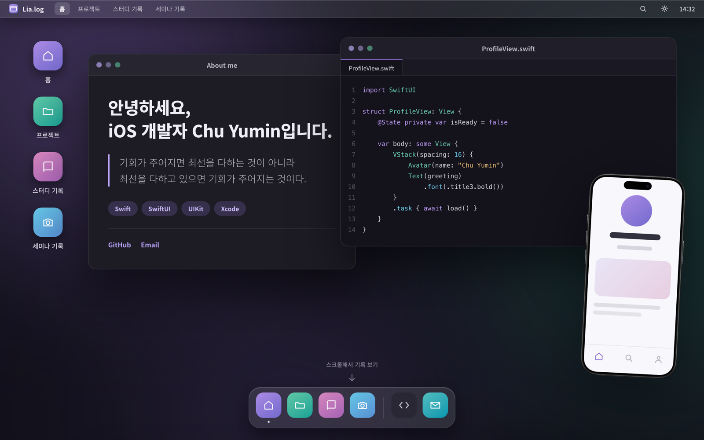
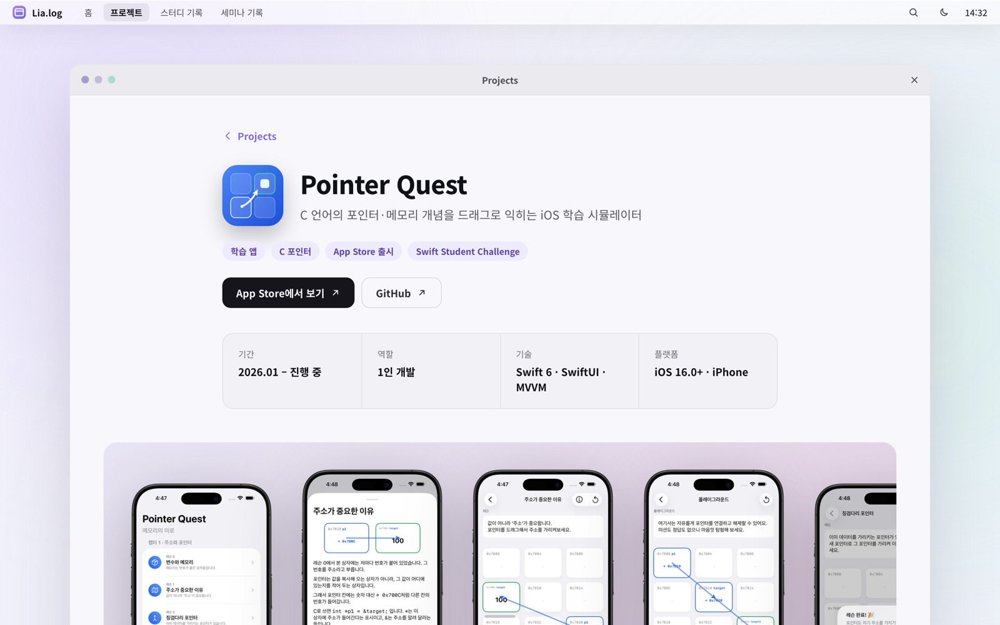
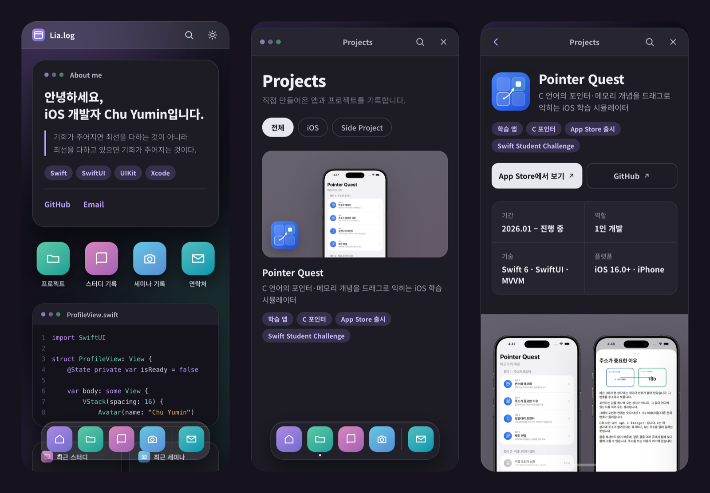

<div align="center">

# Lia.log
**iOS 개발자 Chu Yumin의 기록장**

자기소개와 그동안 만든 앱, 공부한 내용, 다녀온 세미나를 모아 기록하는 개인 홈페이지입니다.

[](https://astro.build)
[](https://www.typescriptlang.org)
[](#기술-스택)
[](https://github.com/yuminc03/my-homepage/actions/workflows/deploy.yml)

**[yuminc03.github.io/my-homepage](https://yuminc03.github.io/my-homepage/)**

</div>

## 스크린샷






## 소개
화면 전체를 하나의 컴퓨터처럼 꾸몄습니다. 데스크톱에서는 메뉴바·바탕화면 아이콘·창·Dock이 있는 PC 데스크톱으로, 모바일에서는 위젯과 앱 아이콘이 놓인 스마트폰 홈 화면으로 보입니다. 각 기록은 "앱"이고, 앱을 누르면 창이 열리며 글을 읽게 됩니다.

| 앱 | 내용 |
|---|---|
| 홈 | 자기소개·기술·연락처, 최근 스터디·세미나 기록 |
| 프로젝트 | 직접 만든 앱. 요약·스크린샷·주요 기능·기술적으로 고민한 점 |
| 스터디 기록 | 공부한 내용을 정리한 글. 목차·코드 블록·읽는 시간 |
| 세미나 기록 | 다녀온 행사의 세션 요약과 사진 |

## 주요 기능
- **반응형 셸** — 모바일(`< 744px`)·태블릿(`744–1179px`)·데스크톱(`≥ 1180px`)마다 화면 구성이 달라집니다. 같은 DOM을 CSS만으로 다르게 배치해, 폭마다 마크업을 따로 두지 않았습니다
- **라이트·다크 테마** — 처음에는 시스템 설정을 따르고, 메뉴바 버튼으로 고정할 수 있습니다. 첫 화면을 그리기 전에 저장된 테마를 적용해 깜빡이지 않습니다
- **페이지 전환 모션** — View Transitions로 페이지 이동을 화면 전환으로 바꿨습니다. 두 주소의 관계에 따라 홈 → 창은 열기, 창 → 홈은 닫기, 목록 ↔ 상세는 옆으로 밀기, 다른 앱으로는 페이드가 되고, 메뉴바와 Dock은 제자리에 남습니다
- **Dock 자동 숨김** — 아래로 스크롤하면 숨고, 위로 올리거나 화면 아래에 마우스를 가져가면 나타납니다
- **콘텐츠 검색** — `⌘K`(Windows는 `Ctrl+K`) 또는 돋보기 버튼으로 엽니다. 빌드할 때 본문까지 담은 색인을 만들어 두고, 서버 없이 브라우저에서 찾습니다
- **목록 필터** — 프로젝트·스터디는 분류 칩으로 거릅니다. 선택한 분류는 주소(`?category=`)에 남아, 새로고침하거나 상세에서 돌아와도 유지됩니다
- **코드 블록** — 파일 이름 머리줄, 줄 번호, 복사 버튼이 붙습니다

## 기술 스택
| 항목 | 내용 |
|---|---|
| 프레임워크 | [Astro 7](https://astro.build) — 빌드할 때 HTML을 만드는 정적 사이트(SSG) |
| 언어 | TypeScript |
| 스타일 | 일반 CSS — 컴포넌트별 스코프 스타일 + 전역 디자인 토큰(`light-dark()`) |
| 콘텐츠 | Markdown·MDX + Content Collections(스키마 검사) |
| 이미지 | `astro:assets` — 빌드할 때 WebP 변환·크기별 생성 |
| 구문 강조 | Shiki + 직접 만든 transformer |
| 배포 | GitHub Actions → GitHub Pages |
| 런타임 의존성 | `astro`, `@astrojs/mdx`, `@astrojs/markdown-satteri` 3개 |

이 사이트는 로그인·댓글 같은 서버 기능이 없고, 글과 사진이 쌓이며, 링크로 공유됩니다. 그래서 React나 Next.js 대신 기본 JS가 0KB이고 완성된 HTML을 내보내는 Astro를 골랐습니다. 비교표와 트레이드오프는 [docs/tech-stack.md](docs/tech-stack.md)에 정리했습니다.

## 시작하기
Node 24를 씁니다(`.nvmrc`). Astro 7은 Node 22.12 이상이 필요합니다.

```bash
git clone https://github.com/yuminc03/my-homepage.git
cd my-homepage
nvm use
npm install
npm run dev
```

개발 서버는 `http://localhost:4321/my-homepage/`에서 열립니다. GitHub Pages 하위 경로에 배포하므로 주소에 `/my-homepage/`가 붙습니다.

| 명령 | 하는 일 |
|---|---|
| `npm run dev` | 개발 서버 |
| `npm run build` | `dist/`에 정적 파일 빌드 |
| `npm run preview` | 빌드 결과 미리보기 |

## 글 쓰기
글 하나가 파일(또는 폴더) 하나입니다. `src/content/` 아래에 컬렉션별로 둡니다.

```
src/content/
├── projects/<이름>/index.md    # 사진을 옆에 두는 폴더형
├── study/<이름>.md
└── seminars/<이름>/index.mdx   # 본문에 사진 컴포넌트(<Photo> 등)를 쓰는 MDX
```

- [docs/content-templates/](docs/content-templates/)의 틀을 복사해 이름을 바꾸고 내용을 채웁니다. 폴더(파일) 이름이 곧 주소입니다
- 주소만 한 문단으로 쓰면 링크 미리보기 카드(북마크 카드)로 바뀝니다
- `draft: true`인 글은 목록·상세·검색에서 빠집니다
- 필드가 빠지거나 형식이 틀리면 빌드가 어떤 필드가 왜 틀렸는지 알려 주며 실패합니다. 스키마는 [src/content.config.ts](src/content.config.ts)에 있습니다

## 배포
`master`에 push하면 [GitHub Actions](.github/workflows/deploy.yml)가 빌드해 GitHub Pages에 올립니다. 브랜치는 Git Flow를 따릅니다.

- `develop`에서 `feature/*` 브랜치를 만들어 작업하고, 끝나면 `develop`에 `--no-ff`로 병합합니다
- 사이트를 갱신할 때만 `develop`을 `master`에 병합합니다. `develop`에 push해도 배포되지 않습니다

## 프로젝트 구조
```
src/
├── pages/        # 주소 = 파일 경로. 홈, 목록 3개, 상세 3개, 검색 색인(search-index.json)
├── layouts/      # BaseLayout(테마·전환) → SiteLayout(메뉴바·Dock·검색 창)
├── components/   # 창, Dock, 카드, 목차, 검색 창 등 화면 조각
├── content/      # 글(Markdown·MDX)과 사진
├── data/         # 앱 목록(apps.ts)과 자기소개(profile.ts)의 단일 기준
├── lib/          # 콘텐츠 헬퍼, 날짜·읽는 시간, 검색, 코드 블록 transformer 등
└── styles/       # 디자인 토큰, 전역·본문·코드 블록·전환 스타일
design/           # 구현 전에 만든 디자인 시안(데스크톱·태블릿·모바일 각 7화면)
docs/             # 기술 스택 결정 문서, 새 글 틀(content-templates), README 스크린샷
```

## 문서
| 문서 | 내용 |
|---|---|
| [docs/tech-stack.md](docs/tech-stack.md) | 기술 스택 비교와 선택 이유, 예상 면접 질문 |
| [PROGRESS.md](PROGRESS.md) | 진행 상황, 확정된 결정과 그 근거 |
| [CLAUDE.md](CLAUDE.md) | 코드 구조와 작업 규칙 요약 |

## 라이선스
© 2026 Chu Yumin. All rights reserved.
